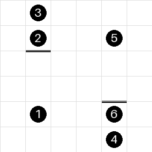
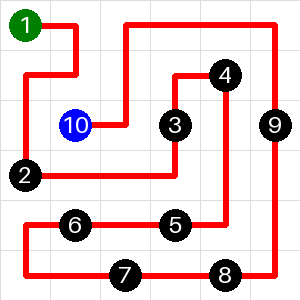

# LinkedIn Zip Solver

## Examples
### Example 1
<p align="middle"> 


</p>

### Example 2
<p align="middle"> 


</p>

### Example 3
<p align="middle"> 


</p>

### Example 4
<p align="middle"> 


</p>


```bash
python -m unittest
python -m unittest test.TestSolver.test_can_solve_grid_2025_0_full
python -m http.server 8000
```

## TODO
link up grid editor to solver api (azure function)
